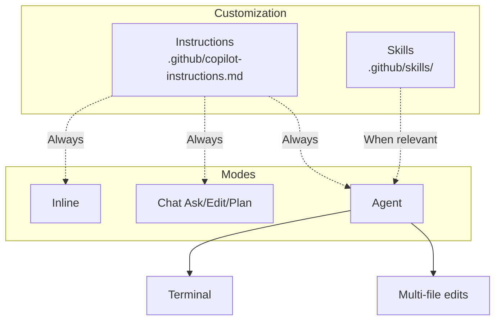

# Introduction — Developing in C with GitHub Copilot

Welcome to the **GitHub Copilot** course for **C**.

This course covers day-to-day GitHub Copilot usage: inline completions, Chat, repo customization and best practices for validating generated code.

## Audience and prerequisites

| Requirement | Detail |
| --------- | ------ |
| Development | Read and write code **C** |
| Git / GitHub | GitHub account, repo and commit basics |
| Editor | Visual Studio Code (recommended) |
| Copilot | Active subscription (Individual, Business or Enterprise) |

## Overall objectives

- Use inline completions with precise prompts.
- Master Copilot Chat (Ask, Edit, Plan, Agent).
- Customize the repo with Instructions and Skills.
- Configure path-specific rules, commits and assisted reviews.
- Apply a validation checklist on generated code.

## Structure — 6 modules

| Module | Topic | Duration |
| ------ | ----- | ----- |
| 1 | Introduction to GitHub Copilot | 2 h |
| 2 | Inline completions and context | 3 h |
| 3 | Chat and interaction modes | 3 h |
| 4 | Agent, Skills and Instructions | 4 h |
| 5 | Path-specific, commit and review | 3 h |
| 6 | Best practices and productivity | 2 h |

Chaque module comprend un **lesson**, des **exercises** et une **solution**.


**Next step :** [Module 1 — Introduction](/formations/en-github-copilot-c/module-01-introduction)

---

# Module 1 — Introduction to GitHub Copilot

This module covers GitHub Copilot basics for **C** development: what the tool is, which mode to use, and how to verify your VS Code setup.

**Estimated duration :** 2 h.

## Objectives

- Define GitHub Copilot and its role as a virtual pair programmer.
- Distinguish inline, Chat, Agent and CLI.
- Install and configure Copilot in VS Code.
- Review usage statistics.

---

> [!note] Definition — GitHub Copilot
> AI assistant in the editor. Analyzes **context** (files, comments, selection) and offers real-time **suggestions**.

## 1.1 What is GitHub Copilot ?

GitHub Copilot est un assistant de programmation basé sur l'intelligence artificielle, développé par GitHub en collaboration avec OpenAI. Il fonctionne comme un **pair-programmer virtuel** intégré directement dans l'éditeur de code.

**How it works :**

- Copilot analyse le contexte du code en cours d'écriture (fichiers ouverts, commentaires, noms de variables)
- Il génère des suggestions de code en temps réel, directement dans l'éditeur
- Le modèle sous-jacent a été entraîné sur des milliards de lignes de code provenant de dépôts publics GitHub
- Il est particulièrement efficace en C grâce à la quantité massive de code C disponible en open source (Linux kernel, GNU tools, etc.)

**What Copilot is not :**

- Ce n'est pas un compilateur ni un vérificateur de code
- Il ne garantit pas que le code généré est correct ou sécurisé
- Il ne remplace pas la compréhension du langage C par le développeur

## 1.2 Les différentes versions — du complétion à l'agent

GitHub Copilot propose plusieurs **niveaux d'autonomie**. La formation s'articule autour du mode **Agent** et de sa personnalisation (**Instructions**, **Skills**), tout en conservant les **completions inline** pour l'écriture au fil de l'eau.

| Version | Niveau d'autonomie | Description | Usage principal |
| -------------------- | ------------------ | ---------------------------------------------- | --------------------------------------- |
| **Copilot (inline)** | Faible | Suggestions de code directement dans l'éditeur | Complétion au quotidien, boilerplate |
| **Copilot Chat** | Moyen | Conversation (Ask, Edit, Plan) | Questions, explications, refactoring |
| **Mode Agent** | Élevé | Planifie, modifie plusieurs fichiers, exécute | Tâches multi-fichiers, debug, migration |
| **Copilot CLI** | Élevé | Agent en ligne de commande | Shell, compilation, CI, scripts |

**Copilot inline** reste le point d'entrée : dès qu'on tape du code, des suggestions apparaissent en gris (`Tab` pour accepter). Voir le **Module 2**.

**Copilot Chat** couvre Ask, Edit, Plan et Agent. Voir le **Module 3**.

**Instructions, Skills et mode Agent** : voir les **Modules 4 et 5**.

**Copilot CLI** (`gh copilot`) reprend la logique agentique hors de l'éditeur — utile pour compiler, lancer Valgrind ou enchaîner des commandes.

## 1.3 Installation and configuration

**Prerequisites :**

- Un compte GitHub avec un abonnement Copilot actif (Individual, Business ou Enterprise)
- Visual Studio Code installé
- Extension C/C++ de Microsoft (pour l'IntelliSense)

**Étapes d'installation :**

1. Ouvrir VS Code
2. Aller dans Extensions (`Ctrl + Shift + X`)
3. Rechercher "GitHub Copilot" et installer l'extension
4. Installer également "GitHub Copilot Chat"
5. Se connecter à GitHub quand VS Code le demande
6. Vérifier l'icône Copilot dans la barre de statut (en bas)

**Vérification du fonctionnement :**
Créer un fichier `test.c` et commencer à taper :

```c
#include <stdio.h>

// Fonction qui affiche Hello World
```

Si Copilot fonctionne, une suggestion devrait apparaître en gris pour compléter la fonction.

## 1.4 Interface et statistiques d'utilisation

Pour consulter les statistiques d'utilisation de Copilot :

- Cliquer sur l'icône Copilot dans la barre de statut de VS Code
- Accéder au tableau de bord via GitHub : `Settings > Copilot > Usage`
- Les métriques disponibles : taux d'acceptation des suggestions, lignes de code générées, langages les plus utilisés

En entreprise (Copilot Business/Enterprise), les administrateurs ont accès à un dashboard détaillé montrant le pourcentage d'utilisation par équipe et par développeur.

---

---

# Module 2 — Inline completions and context

In [module 1](/formations/en-github-copilot-c/module-01-introduction) we set up Copilot. **Inline completions** speed up C boilerplate (utility functions, tests). This module covers shortcuts, context and comment-prompts.

**Estimated duration :** 3 h.

## Objectives

- Master inline suggestion keyboard shortcuts.
- Explain the context window and its limits.
- Write comment-prompts (What / How / Constraints).
- Iterate: alternatives, partial accept, rephrase.

---

Les **completions inline** sont le mode le plus utilisé au quotidien. Une fois les **Instructions** configurées (Module 4), elles produisent des suggestions alignées sur les standards du projet C.

> [!note] Definition — Inline completion
> Suggestion shown **in grey** while typing. Accept (`Tab`), reject (`Esc`) or browse alternatives.

## 2.1 Essential keyboard shortcuts

| Action | Raccourci (Windows/Linux) | Raccourci (Mac) |
| -------------------------------- | ------------------------- | --------------- |
| Accepter la suggestion | `Tab` | `Tab` |
| Rejeter la suggestion | `Échap` | `Échap` |
| Suggestion suivante | `Alt + ]` | `Option + ]` |
| Suggestion précédente | `Alt + [` | `Option + [` |
| Accepter le mot suivant | `Ctrl + →` | `Cmd + →` |
| Déclencher manuellement | `Alt + \` | `Option + \` |
| Ouvrir le panneau de suggestions | `Ctrl + Enter` | `Ctrl + Enter` |

Le panneau de suggestions (`Ctrl + Enter`) ouvre une fenêtre avec jusqu'à 10 suggestions alternatives. Utile quand la première suggestion ne convient pas.

## 2.2 Triggering suggestions

### Commencer à taper une signature de fonction

```c
int calculate_factorial(int n)
```

Copilot va proposer le corps de la fonction en se basant sur le nom explicite.

### Écrire un commentaire descriptif

```c
// Tri à bulles sur un tableau d'entiers, retourne le tableau trié
void bubble_sort(int arr[], int size)
```

Le commentaire guide Copilot sur l'algorithme attendu.

### Créer une structure de données

```c
typedef struct {
 char name[50];
 int age;
 float salary;
} Employee;
```

Après avoir défini la structure, Copilot pourra suggérer des fonctions de manipulation cohérentes (create, print, free, etc.).

### Nommer une variable de manière explicite

```c
int max_retry_count = 3;
char *error_message = NULL;
FILE *input_file = fopen("data.csv", "r");
```

Des noms de variables clairs aident Copilot à comprendre l'intention du code.

## 2.3 Context matters

Copilot ne se base pas uniquement sur la ligne en cours. Il analyse un **contexte élargi** :

**Les fichiers ouverts dans l'éditeur :**
Si vous avez un fichier `utils.h` ouvert avec des prototypes, Copilot les utilisera pour générer des implémentations cohérentes dans `utils.c`.

**Les includes influencent les suggestions :**

```c
#include <pthread.h> // Copilot va suggérer du code multithread
#include <sys/socket.h> // Copilot va suggérer du code réseau
#include <sqlite3.h> // Copilot va suggérer du code base de données
```

**Le code environnant guide la génération :**
Si les fonctions précédentes utilisent un style particulier (gestion d'erreurs avec des codes de retour, allocation dynamique avec vérification), Copilot va reproduire ce pattern.

```c
// Si votre code existant fait ceci :
int *ptr = malloc(sizeof(int) * n);
if (ptr == NULL) {
 fprintf(stderr, "Erreur allocation mémoire\n");
 return -1;
}

// Copilot va reproduire ce pattern de vérification dans les suggestions suivantes
```

## 2.4 La fenêtre de contexte (context window)

La **fenêtre de contexte** (ou _context window_) est la quantité maximale de texte — code, commentaires, historique de chat, instructions du projet — que le modèle peut prendre en compte **en une seule requête**.

**Definition concrète :**

- Tout ce que Copilot « voit » avant de répondre occupe cette fenêtre : fichiers ouverts, sélection, messages du chat, `@workspace`, instructions Copilot, etc.
- Cette limite se mesure en **tokens** (morceaux de texte), pas en lignes de code. Une ligne C dense ou un long commentaire consomme plus qu'une ligne vide.
- Au-delà de la limite, le contenu le plus ancien ou le moins prioritaire est **tronqué** : le modèle ne peut plus s'appuyer dessus, même s'il est encore visible dans votre éditeur.

**Pourquoi c'est important :**

| Conséquence | Explication |
| --------------------------------- | --------------------------------------------------------------------------------------------------------------------------------------------------- |
| **Perte de contexte** | Un gros fichier + tout l'historique du chat peuvent faire « oublier » le début de la conversation ou des fichiers éloignés. |
| **Suggestions moins cohérentes** | Si vos conventions (nommage, gestion d'erreurs) ne tiennent plus dans la fenêtre, Copilot revient à des patterns génériques appris sur tout GitHub. |
| **Réponses incomplètes en Agent** | Sur un gros dépôt, l'agent ne charge pas tout le code d'un coup ; il doit cibler les bons fichiers. |
| **Coût de qualité du prompt** | Chaque mot utile (commentaire précis, prototype dans le `.h`) remplace du bruit ; un contexte pertinent vaut mieux qu'un contexte volumineux. |

**Best practices pour optimiser la fenêtre :**

- Garder ouverts uniquement les fichiers **pertinents** pour la tâche en cours (ex. `utils.h` + `utils.c`, pas tout le projet).
- Poser des questions **ciblées** dans le chat plutôt que de coller des milliers de lignes.
- Utiliser `#file:path/to/file.c` pour un fichier précis plutôt que `#workspace` quand la question est locale.
- Découper les grosses refontes en étapes (module par module) au lieu d'une seule demande globale.
- Centraliser les règles du projet dans les **Instructions** (voir Module 4) plutôt que de les répéter à chaque message.

## 2.5 L'art du commentaire-prompt

En C, les commentaires sont le principal levier pour guider Copilot. Un commentaire bien rédigé produit un code de meilleure qualité qu'un nom de fonction seul.

**Commentaire vague → résultat imprécis :**

```c
// trier le tableau
```

**Commentaire précis → résultat ciblé :**

```c
// Tri par insertion sur un tableau d'entiers en ordre croissant
// Complexité : O(n²) dans le pire cas, O(n) dans le meilleur cas
// Modifie le tableau en place
void insertion_sort(int arr[], int n)
```

## 2.6 Principes de base

**Être spécifique et précis :**

```c
// ❌ Vague
// lire un fichier

// ✅ Précis
// Lire un fichier texte ligne par ligne, stocker chaque ligne dans un tableau
// dynamique de chaînes, retourner le nombre de lignes lues
// Retourne -1 en cas d'erreur d'ouverture
int read_lines(const char *filename, char ***lines)
```

**Donner du contexte :**

```c
// Cette fonction fait partie d'un allocateur mémoire custom
// Elle recherche un bloc libre de taille suffisante dans la free list
// Utilise la stratégie first-fit
void *find_free_block(size_t size)
```

**Décomposer les problèmes complexes :**
Plutôt que de demander une fonction monolithique, découper en étapes :

```c
// Étape 1 : Parser la ligne CSV en tokens séparés par des virgules
char **parse_csv_line(const char *line, int *count);

// Étape 2 : Convertir les tokens en structure Employee
Employee token_to_employee(char **tokens);

// Étape 3 : Insérer l'employé dans le tableau dynamique
int insert_employee(Employee **employees, int *size, int *capacity, Employee emp);
```

**Itérer sur les suggestions :**
Si la première suggestion ne convient pas, utiliser `Alt + ]` pour voir les alternatives, ou reformuler le commentaire.

## 2.7 Structure d'un bon prompt

Un prompt efficace pour Copilot suit la structure **Quoi / Comment / Contraintes** :

```c
/**
 * QUOI : Recherche un élément dans un tableau trié
 * COMMENT : Utilise la recherche dichotomique (binary search)
 * CONTRAINTES :
 * - Le tableau doit être trié en ordre croissant
 * - Retourne l'index de l'élément ou -1 si non trouvé
 * - Fonctionne pour des tableaux jusqu'à INT_MAX éléments
 */
int binary_search(const int arr[], int size, int target)
```

Autre exemple avec gestion mémoire :

```c
/**
 * QUOI : Crée une copie profonde d'une liste chaînée
 * COMMENT : Parcours itératif avec allocation de nouveaux nœuds
 * CONTRAINTES :
 * - Retourne NULL si la liste source est NULL ou en cas d'erreur malloc
 * - L'appelant est responsable de libérer la copie avec free_list()
 * - Les données (char*) sont dupliquées avec strdup
 */
Node *deep_copy_list(const Node *head)
```

## 2.8 Itération et raffinement

**Accepter partiellement une suggestion :**
Utiliser `Ctrl + →` (accepter mot par mot) quand le début de la suggestion est bon mais la suite diverge. Cela permet de garder le contrôle tout en profitant de l'assistance.

**Modifier et relancer pour affiner :**

```c
// Premier essai - suggestion trop simple
// Trier un tableau
// → Copilot génère un bubble sort basique

// Deuxième essai - plus précis
// Quicksort avec pivot médian de trois, partition de Lomuto
// Gère les tableaux de taille < 10 avec insertion sort
void quicksort(int arr[], int low, int high)
```

**Combiner plusieurs suggestions :**
Accepter une suggestion pour le squelette de la fonction, puis supprimer certaines parties et redemander à Copilot de les régénérer avec un commentaire plus spécifique.

---

---

---

# Module 3 — Chat and interaction modes

After [inline completions](/formations/en-github-copilot-c/module-02-completions-inline), this module covers **Copilot Chat** to debug and plan C refactorings.

**Estimated duration :** 3 h.

## Objectives

- Use Ask, Edit, Plan and Agent modes.
- Select context (@workspace, #file, selection).
- Use slash commands (/explain, /fix, /tests).
- Understand semantic codebase indexing.

---

## 3.1 Les modes du Chat — Ask, Edit, Plan, Agent

Copilot Chat propose plusieurs **modes** selon le niveau d'autonomie souhaité. Ils partagent les **Instructions** du projet ; seuls **Agent** et partiellement **Ask** exploitent les **Skills** (voir Module 4).

| Mode | Autonomie | Comportement | Exemple en C |
| ---------- | --------- | ------------------------------------------------- | ------------------------------------------------- |
| **Ask** | Faible | Répond, explique, ne modifie pas les fichiers | « Explique cette gestion de free list » |
| **Edit** | Moyenne | Modifie le code sélectionné ou le fichier actif | « Ajoute la vérification NULL sur ce malloc » |
| **Plan** | Moyenne | Produit un plan détaillé avant d'agir | « Plan pour migrer ce module vers C11 _Generic » |
| **Agent** | Élevée | Planifie, édite, exécute, itère | « Corrige les warnings -Wall sur tout src/ » |

**Ask** — mode par défaut pour comprendre du code sans risque de modification :

- Sélectionner un bloc, poser une question : « Pourquoi ce segfault ? »
- Les Instructions s'appliquent (ex. réponse alignée sur vos conventions Doxygen)

**Edit** — pour des changements localisés :

- Sélectionner une fonction, demander « /fix » ou « ajoute la gestion d'erreur »
- Plus rapide que l'Agent pour une modification ponctuelle

**Plan** — pour les grosses tâches :

- « Refactorise le module parser en séparant lexer et tokenizer »
- Copilot produit un plan numéroté ; vous validez avant passage en Agent

**Agent** — cœur de l'approche agentique (voir Module 4) :

- Accès terminal, multi-fichiers, index sémantique
- Active automatiquement les **Skills** pertinents
- Idéal : debug Valgrind, migration API, ajout de tests sur tout un module

## 3.2 Interface conversationnelle

Ouvrir le panneau Chat : `Ctrl + Shift + I` (ou `Cmd + Shift + I` sur Mac).

Copilot Chat permet de poser des questions en langage naturel directement dans VS Code :

**Exemples de questions utiles en C :**

- "Explique-moi ce que fait cette fonction"
- "Pourquoi ce code provoque un segfault ?"
- "Comment implémenter un pool de threads en C ?"
- "Génère les tests unitaires pour cette fonction"
- "Optimise cette boucle pour réduire les cache misses"

**Obtenir des explications détaillées :**
Sélectionner un bloc de code complexe puis demander dans le chat :
"Explique ce code étape par étape, en particulier la gestion de la mémoire"

## 3.3 Commandes slash

Les commandes slash sont des raccourcis pour des actions fréquentes :

| Commande | Action |
| ---------- | --------------------------------------------------- |
| `/explain` | Explique le code sélectionné |
| `/fix` | Propose une correction pour le code sélectionné |
| `/tests` | Génère des tests pour le code sélectionné |
| `/doc` | Génère la documentation (commentaires Doxygen en C) |
| `/new` | Crée un nouveau fichier/projet |
| `/clear` | Efface l'historique du chat |

**Exemple avec `/doc` sur une fonction C :**

```c
// Avant /doc
int add_node(LinkedList *list, void *data, size_t data_size);

// Après /doc - Copilot génère :
/**
 * @brief Ajoute un nouveau nœud en tête de la liste chaînée
 * @param list Pointeur vers la liste chaînée
 * @param data Pointeur vers les données à copier dans le nœud
 * @param data_size Taille en octets des données à copier
 * @return 0 en cas de succès, -1 en cas d'erreur d'allocation
 */
int add_node(LinkedList *list, void *data, size_t data_size);
```

## 3.4 Sélection de contexte

**Sélectionner du code avant de poser une question :**
Surligner un bloc de code, puis ouvrir le chat → Copilot comprend que la question porte sur ce code précis.

## 3.5 Indexation sémantique du codebase

L'**indexation sémantique** (ou _semantic codebase indexing_) permet à Copilot de **comprendre le sens** du code du projet, pas seulement de faire correspondre des mots-clés.

**Principe :**

- Le dépôt est analysé et transformé en représentations vectorielles (embeddings) : fonctions, structures, commentaires, relations entre fichiers.
- Une question du type « Où est gérée l'allocation mémoire ? » ou `@workspace trouve les fuites potentielles` s'appuie sur cette index, pas sur une simple recherche texte `grep`.
- Les résultats les plus **pertinents sémantiquement** sont injectés dans la fenêtre de contexte avant la génération de la réponse.

**Différence avec le contexte « classique » :**

| Approche | Limite |
| --------------------------------- | ------------------------------------------------------------------------------------------------ |
| Fichiers ouverts + ligne courante | Ne couvre que ce que vous avez sous les yeux |
| Recherche par nom de symbole | Rate les implémentations sous un autre nom ou les patterns répétés |
| **Index sémantique** | Retrouve du code par **intention** (« parsing CSV », « free list », « gestion d'erreur malloc ») |

**Quand l'utiliser :**

- Explorer un projet inconnu : `#workspace décris l'architecture et les modules principaux`
- Refactoring transversal : retrouver toutes les fonctions qui dupliquent une logique
- Debugging : localiser où une structure ou une API est utilisée sans connaître le nom exact

**Best practices :**

- Laisser l'indexation se terminer après un clone ou un gros pull (indicateur dans la barre de statut / paramètres Copilot).
- Formuler des requêtes avec des **concepts** (« liste chaînée », « tri en place ») plutôt qu'un seul identifiant C.
- Combiner index sémantique + `#file:path/to/file.c` : d'abord localiser avec `#workspace`, puis affiner sur le fichier trouvé.
- Rappel : l'index alimente la fenêtre de contexte — rester précis évite de noyer le modèle sous trop d'extraits.

## 3.6 Mode Agent en pratique

Le **mode Agent** est le point d'application des **Skills** et **Instructions** configurés au Module 4.

Copilot peut :

- Exécuter des commandes terminal (`gcc`, `make`, `valgrind`, `cppcheck`)
- Modifier plusieurs fichiers en séquence
- Itérer jusqu'à résoudre un problème ou signaler un blocage

**Exemple complet en C :**

```
Mode Agent : « Corrige tous les memory leaks détectés par Valgrind dans ce projet »
→ Copilot active le skill valgrind-audit (si présent)
→ Applique les Instructions (vérification malloc, snake_case)
→ Lance Valgrind, analyse la sortie, corrige les fichiers, recompile, vérifie
```

**Best practices Agent :**

- Formuler un **objectif mesurable** (« 0 fuite Valgrind sur test_parser »)
- Laisser l'indexation sémantique se terminer sur les gros dépôts
- Vérifier manuellement le diff avant commit — l'agent accélère, il ne remplace pas la relecture

## 3.7 Mode Cloud (aperçu)

Le mode Cloud permet d'exécuter des tâches Copilot sur l'infrastructure GitHub :

- Tâches longues qui tournent en arrière-plan
- Pas besoin de garder VS Code ouvert
- Résultats disponibles via notification ou PR
- Utile pour des refactorings massifs ou des migrations de code

---

---

# Module 4 — Agent, Skills and Instructions

In [module 3](/formations/en-github-copilot-c/module-03-chat-modes) we explored Chat. This module covers **agent customization**: Instructions, Skills and Agent mode.

**Estimated duration :** 4 h.

## Objectives

- Write `.github/copilot-instructions.md` for a C project.
- Create a domain Skill (lint, tests, typecheck).
- Understand the Instructions → Skills → Agent flow.
- Test customization in Agent mode.

---

> [!note] Definition — Instructions
> **Permanent** repo rules injected on every interaction. Main file: `.github/copilot-instructions.md`.

> [!note] Definition — Instructions
> **Permanent** repo rules injected on every interaction. File: `.github/copilot-instructions.md`.

## 4.1 Overview

| Concept | Role | When active | Typical file |
| ------- | ---- | ----------- | -------------- |
| **Instructions** | Permanent project rules | **Always** (inline, chat, agent) | `.github/copilot-instructions.md` |
| **Skill** | Specialized workflow, loaded on demand | When the task matches the description | `.github/skills/<name>/SKILL.md` |
| **Agent** | Autonomous mode that plans and executes | On explicit request (Agent mode) | Chat panel or Copilot CLI |

**Instructions** define _how to code in this repo_. **Skills** teach _how to accomplish a recurring task_. **Agent** _orchestrates_ both.

| | Instructions | Skill |
| --- | --- | --- |
| **Content** | Short rules, project standards | Detailed workflow, scripts, references |
| **Activation** | Always | Only when the task is relevant |

## 4.2 Global Instructions — `.github/copilot-instructions.md`

File at the repository root (`.github/` folder). Copilot injects it in **every** interaction.

| File | Scope |
| ---- | ----- |
| `.github/copilot-instructions.md` | Global — entire repo |
| `.github/instructions/*.md` | Path-specific (`applyTo` in YAML header) |
| Personal instructions | GitHub → Settings → Copilot (all your projects) |

**Example:**

```markdown
# Instructions — C project

- C11 standard ; compile with `-Wall -Wextra -Werror`
- snake_case functions/variables ; module prefix (`list_add`)
- Check every `malloc` / `calloc` (NULL return)
- Document public API with Doxygen
- Error handling via return codes (0 = success, <0 = error)
```

**Best practices:**

- Keep it **short** (≤ 200 lines) — details belong in a Skill or path-specific instruction (module 5).
- Document _why_ a rule exists, not only _what_.
- Pedagogical rules: do not complete exercise stubs for students.

> Instructions stay **general**. For a detailed workflow, prefer a **Skill**.

## 4.3 Skills — `.github/skills/<name>/SKILL.md`

> [!note] Definition — Skill
> Folder with `SKILL.md` (`name`, `description` in YAML frontmatter). Copilot loads the skill **when the task matches** the YAML description.

**Structure:**

```
.github/skills/
└── lint-and-check/
 ├── SKILL.md
 ├── scripts/
 └── references/
```

**Example `SKILL.md`:**

```markdown
---
name: lint-and-check
description: Compiles with gcc and runs Valgrind. Use when the user mentions memory leak, segfault, valgrind or compiler warning.
---

## Workflow

1. `make` or `gcc -Wall -Wextra`
2. `./run_tests` if available
3. `valgrind --leak-check=full` on test binaries
4. Fix leaks and warnings
```

| Action | Documentation |
| ------ | ------------- |
| Create a skill | [About agent skills](https://docs.github.com/en/copilot/concepts/agents/about-agent-skills) |
| Repository instructions | [Repository custom instructions](https://docs.github.com/en/copilot/customizing-copilot/adding-repository-custom-instructions-for-github-copilot) |

## 4.4 Agent mode in practice

**Agent mode** (Module 3) applies the Instructions and Skills configured above.

**Capabilities:**

- Run terminal commands (`gcc, make, valgrind`)
- Edit multiple files in sequence
- Iterate until a measurable goal is met or report a blocker

**Example:**

```
Agent mode: "Fix all memory leaks reported by Valgrind"
→ Runs Valgrind, analyzes, fixes, rebuilds
```

**Best practices:**

- **Measurable** goal ("0 gcc warnings", "green tests")
- Review the diff before commit
- Let semantic indexing finish on large repos

## 4.5 Architecture diagram



## 4.6 Minimal setup

1. **Global Instructions** — `.github/copilot-instructions.md`
2. **Test instructions** — `.github/instructions/tests.md` with `applyTo: "**/test_*.c,**/tests/**"`
3. **One domain skill** — `.github/skills/lint-and-check/SKILL.md`
4. **Test in Agent** — `@workspace Fix gcc -Wall warnings and Valgrind leaks`

## 4.7 Reusable prompts (optional)

`.github/prompts/*.prompt.md` — templates for recurring requests (complement to Skills).

```markdown
<!-- .github/prompts/new-module.prompt.md -->
Create a new module with:
- `module.h` exporting the public API
- `.h` file with include guards
- Implementations in `.c` ; tests if present
```

---

# Module 5 — Path-specific, commit and review

In [module 4](/formations/en-github-copilot-c/module-04-agent-skills) we set global Instructions. This module shows how to refine Copilot **per repo area**: API, tests and C source follow different rules.

**Estimated duration :** 3 h.

## Objectives

- Configure path-specific instructions (applyTo).
- Create advanced Skills with scripts.
- Generate commit messages with Copilot.
- Run an assisted code review.

---

## 5.1 Instructions path-specific

Les concepts **Agent**, **Skill** et **Instruction** sont détaillés au **Module 4**. Ce module approfondit la **personnalisation par chemin**, les skills avancés, le commit et la code review.

## 5.2 Instructions spécifiques par chemin (path-specific)

Les instructions **globales** s'appliquent à tout le dépôt. Les instructions **path-specific** ne s'activent que lorsque Copilot travaille sur des fichiers dont le chemin correspond à un **motif** (glob).

**Pourquoi les utiliser :**

- Un module C embarqué (MISRA, pas de `malloc`) n'a pas les mêmes règles qu'un outil CLI avec allocation libre.
- Les tests (`tests/`) peuvent exiger des macros ou du style différent du code de production (`src/`).
- Les headers publics (`include/`) et les implémentations (`src/`) peuvent demander des conventions distinctes (Doxygen, include guards, etc.).

**Organisation recommandée (GitHub Copilot) :**

Placer des fichiers Markdown dans `.github/instructions/`, chacun avec un en-tête YAML indiquant les chemins concernés :

```markdown
---
applyTo: "src/**/*.c,src/**/*.h"
---

# Règles pour le code source C

- Standard C11, pas d'extensions GNU sauf si déjà présent dans le fichier
- Vérifier systématiquement le retour de malloc/calloc/realloc
- snake_case pour fonctions et variables ; préfixe module pour l'API publique
```

```markdown
---
applyTo: "tests/**/*.c"
---

# Règles pour les tests

- Utiliser uniquement assert() et des helpers déjà définis dans test_common.h
- Pas de printf de debug : utiliser les macros TEST_LOG si besoin
- Un fichier de test par module testé (test_parser.c pour parser.c)
```

```markdown
---
applyTo: "exercices/**/*.c"
---

# Contexte pédagogique — exercices étudiants

- Leave exercise stubs intact ; ne pas implémenter à la place de l'étudiant
- Suggérer des indices dans les commentaires plutôt que des solutions complètes
- Rester aligné sur les énoncés du fichier (noms de fonctions imposés)
```

**Ordre de priorité (du plus général au plus spécifique) :**

1. Instructions globales (`.github/copilot-instructions.md`)
2. Instructions path-specific dont le glob correspond au fichier actif
3. Contexte immédiat (fichier ouvert, sélection, commentaire-prompt)

**Best practices :**

- Préférer des globs **étroits** (`src/net/*.c`) à `**/*` pour éviter des règles contradictoires.
- Documenter dans chaque fichier _pourquoi_ la règle existe (évite que Copilot la « contourne »).
- Aligner les instructions path-specific avec la structure réelle du repo (`exercices/`, `correction/`, `tests/`).
- Vérifier qu'une consigne globale n'annule pas une consigne locale (ex. « toujours compléter le code » vs exercises with stubs to complete).

**Créer des Skills avancés :**

- Placer des scripts dans `scripts/` (ex. wrapper Valgrind avec options du projet)
- Externaliser la doc lourde dans `references/` pour préserver la fenêtre de contexte
- Affiner la `description` YAML — c'est le **déclencheur** de sélection du skill

## 5.3 Prompts réutilisables (`.github/prompts/`)

Modèles de demande invoqués manuellement dans le chat (complément aux Skills — voir Module 4) :

```markdown
<!-- .github/prompts/new-module.prompt.md -->

Crée un nouveau module C avec :

- Un fichier header (.h) avec include guards
- Un fichier source (.c) avec implémentations
- Fonctions init et cleanup du module
- Documentation Doxygen pour chaque fonction publique
```

## 5.4 Commit automatique

Copilot peut générer automatiquement des messages de commit pertinents :

- Cliquer sur l'icône Copilot dans la vue Source Control
- Copilot analyse les changements (diff) et propose un message
- Le message suit les conventions du projet (Conventional Commits si configuré)

Exemple :

```
feat(parser): add CSV parsing with quoted field support

- Handle escaped quotes within fields
- Support multiline values enclosed in quotes
- Add error reporting with line numbers
```

## 5.5 Code review sur les commits en cours

Copilot peut relire le code avant de commiter :

- Dans l'onglet Source Control, utiliser "Review Changes" avec Copilot
- Il identifie : bugs potentiels, fuites mémoire, problèmes de style, suggestions d'amélioration
- Particulièrement utile en C pour détecter :
 - Accès hors limites de tableaux
 - Pointeurs non initialisés
 - Double free / use after free
 - Buffer overflows

## 5.6 Fine tuning et personnalisation

**Adapter Copilot au style du projet :**

- Les **Instructions** (Module 4) influencent toutes les suggestions — inline, chat et agent
- Les **Skills** standardisent les workflows répétitifs (audit mémoire, création de module)
- Copilot apprend aussi des patterns du code existant dans le dépôt
- Utiliser des fichiers d'exemple comme « modèles » que Copilot reproduira

---

---

# Module 6 — Best practices and productivity

In [module 5](/formations/en-github-copilot-c/module-05-path-specific-review) we refined governance. This closing module covers **when** to trust Copilot and **how** to validate generated C code.

**Estimated duration :** 2 h.

## Objectives

- Apply a validation checklist on generated code.
- Identify suitable (and unsuitable) Copilot use cases.
- Adopt a sustainable productivity workflow.
- Formalize team best practices.

---

## 6.1 Validation du code généré

Le code produit par Copilot en C nécessite une vigilance particulière :

**Toujours vérifier :**

- La gestion mémoire (malloc/free, pas de fuites, pas de double free)
- Les accès aux tableaux (pas de dépassement de bornes)
- Les pointeurs (vérification de NULL avant déréférencement)
- Les types et le casting (overflow d'entiers, troncature)
- La gestion des erreurs (retours de fonctions système)

**Outils de validation :**

```bash
# Compilation avec warnings stricts
gcc -Wall -Wextra -Werror -fsanitize=address,undefined -g -o prog main.c

# Analyse statique
cppcheck --enable=all --inconclusive src/

# Détection de fuites mémoire
valgrind --leak-check=full --show-leak-kinds=all ./prog
```

## 6.2 Quand utiliser Copilot

**Code répétitif ou boilerplate :**

```c
// Copilot excelle pour générer des fonctions CRUD similaires
Employee *employee_create(const char *name, int age, float salary);
void employee_destroy(Employee *emp);
void employee_print(const Employee *emp);
int employee_serialize(const Employee *emp, FILE *out);
Employee *employee_deserialize(FILE *in);
```

**Implémentation d'algorithmes classiques :**
Tri, recherche, parcours de graphe, tables de hachage — Copilot connaît les implémentations standards.

**Tests unitaires :**

```c
// Demander à Copilot : "Génère les tests pour la fonction binary_search"
// Il produit des cas de test pertinents :
void test_binary_search_found(void) {
 int arr[] = {1, 3, 5, 7, 9, 11};
 assert(binary_search(arr, 6, 7) == 3);
}

void test_binary_search_not_found(void) {
 int arr[] = {1, 3, 5, 7, 9, 11};
 assert(binary_search(arr, 6, 4) == -1);
}

void test_binary_search_empty(void) {
 int arr[] = {};
 assert(binary_search(arr, 0, 5) == -1);
}
```

**Exploration de nouvelles APIs :**
Quand on utilise une bibliothèque peu familière (libcurl, OpenSSL, SQLite), Copilot aide à écrire le boilerplate d'initialisation.

## 6.3 Quand être prudent

**Code critique pour la sécurité :**
Cryptographie, authentification, parsing d'entrées utilisateur — toujours relire manuellement et tester en profondeur.

**Logique métier complexe :**
Les règles métier spécifiques au projet ne sont pas connues de Copilot. Il peut générer du code syntaxiquement correct mais sémantiquement faux.

**Code avec des contraintes spécifiques :**
Systèmes embarqués avec mémoire limitée, code temps réel, conformité à des normes (MISRA C, DO-178C) — Copilot ne connaît pas ces contraintes.

**Optimisations de performance critiques :**
Copilot génère du code fonctionnel mais rarement optimal. Pour du code critique en performance (boucles internes, SIMD, cache-friendly), l'expertise humaine reste indispensable.

## 6.4 Productivité optimale

**Utiliser Copilot comme assistant, pas comme remplacement :**

- Lire et comprendre chaque suggestion avant de l'accepter
- Ne jamais accepter aveuglément du code qu'on ne comprend pas
- Copilot accélère l'écriture, il ne dispense pas de la réflexion

**Apprendre des suggestions pour s'améliorer :**

- Copilot peut montrer des patterns ou des fonctions de la bibliothèque standard qu'on ne connaît pas
- Observer les suggestions est une forme d'apprentissage passif
- Exemple : découvrir `qsort`, `bsearch`, `srtok_rt` via les suggestions

**Adapter son workflow progressivement :**

1. **Completions inline** — accepter les suggestions pour le boilerplate (Module 2)
2. **Chat Ask/Edit** — debugging et documentation ciblée (Module 3)
3. **Instructions** — créer `.github/copilot-instructions.md` (Module 4)
4. **Skills** — documenter un workflow récurrent (Module 5)
5. **Mode Agent** — tâches multi-fichiers avec vérification manuelle du diff

---
