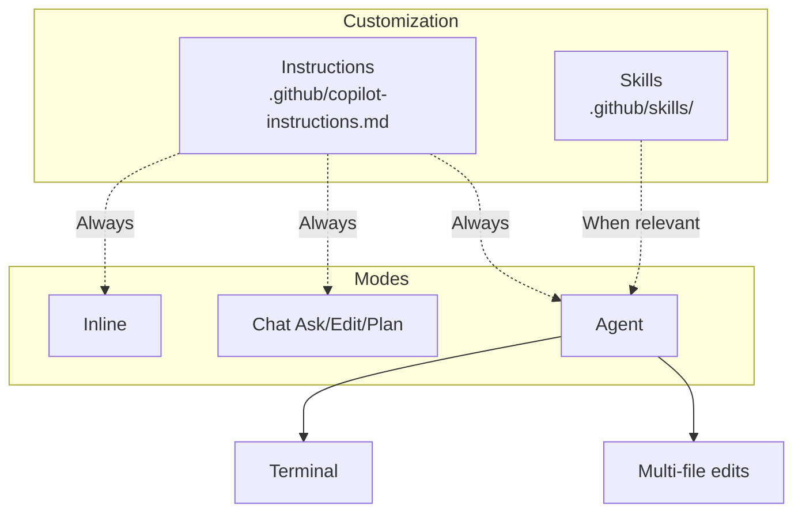

# Introduction — Developing in C with GitHub Copilot

Welcome to the **GitHub Copilot** course for **C**.

This course covers day-to-day GitHub Copilot usage: inline completions, Chat, repo customization and best practices for validating generated code.

## Audience and prerequisites

| Requirement | Detail |
| --------- | ------ |
| Development | Read and write code **C** |
| Git / GitHub | GitHub account, repo and commit basics |
| Editor | Visual Studio Code (recommended) |
| Copilot | Active subscription (Individual, Business or Enterprise) |

## Overall objectives

- Use inline completions with precise prompts.
- Master Copilot Chat (Ask, Edit, Plan, Agent).
- Customize the repo with Instructions and Skills.
- Configure path-specific rules, commits and assisted reviews.
- Apply a validation checklist on generated code.

## Structure — 6 modules

| Module | Topic | Duration |
| ------ | ----- | ----- |
| 1 | Introduction to GitHub Copilot | 2 h |
| 2 | Inline completions and context | 3 h |
| 3 | Chat and interaction modes | 3 h |
| 4 | Agent, Skills and Instructions | 4 h |
| 5 | Path-specific, commit and review | 3 h |
| 6 | Best practices and productivity | 2 h |

Chaque module comprend un **lesson**, des **exercises** et une **solution**.


**Next step :** [Module 1 — Introduction](/formations/en-github-copilot-c/module-01-introduction)

---

# Module 1 — Introduction to GitHub Copilot

This module covers GitHub Copilot basics for **C** development: what the tool is, which mode to use, and how to verify your VS Code setup.

**Estimated duration :** 2 h.

## Objectives

- Define GitHub Copilot and its role as a virtual pair programmer.
- Distinguish inline, Chat, Agent and CLI.
- Install and configure Copilot in VS Code.
- Review usage statistics.

---

> [!note] Definition — GitHub Copilot
> AI assistant in the editor. Analyzes **context** (files, comments, selection) and offers real-time **suggestions**.

## 1.1 What is GitHub Copilot?

GitHub Copilot is an AI-powered programming assistant developed by GitHub in collaboration with OpenAI. It works as a **virtual pair-programmer** integrated directly into the code editor.

**How it works:**

- Copilot analyzes the context of code being written (open files, comments, variable names)
- It generates code suggestions in real time, directly in the editor
- The underlying model was trained on billions of lines of code from public GitHub repositories
- It is particularly effective in C thanks to the massive amount of open source C code available (Linux kernel, GNU tools, etc.)

**What Copilot is not:**

- It is not a compiler or code verifier
- It does not guarantee that generated code is correct or secure
- It does not replace the developer's understanding of the C language

## 1.2 The different versions

| Version | Description | Primary use |
|---------|-------------|-------------|
| **Copilot (inline)** | Code suggestions directly in the editor | Day-to-day code writing |
| **Copilot Chat** | Integrated conversational interface | Questions, explanations, refactoring |
| **Copilot CLI** | Command-line assistant | Shell commands, compilation, debugging |

**Copilot inline** is the default mode: as soon as you type code, suggestions appear in gray. You can accept them with `Tab` or ignore them by continuing to type.

**Copilot Chat** allows you to have a conversation with the AI: explain code, request corrections, generate tests.

**Copilot CLI** helps build terminal commands:

```bash
# Example: ask Copilot CLI how to compile with debug flags
gh copilot suggest "compile main.c with debug symbols and all warnings"
# Suggestion: gcc -g -Wall -Wextra -o main main.c
```

## 1.3 Installation and configuration

**Prerequisites:**

- A GitHub account with an active Copilot subscription (Individual, Business, or Enterprise)
- Visual Studio Code installed
- Microsoft C/C++ extension (for IntelliSense)

**Installation steps:**

1. Open VS Code
2. Go to Extensions (`Ctrl + Shift + X`)
3. Search for "GitHub Copilot" and install the extension
4. Also install "GitHub Copilot Chat"
5. Sign in to GitHub when VS Code prompts you
6. Check for the Copilot icon in the status bar (bottom)

**Verifying it works:**
Create a `test.c` file and start typing:

```c
#include <stdio.h>

// Function that prints Hello World
```

If Copilot is working, a suggestion should appear in gray to complete the function.

## 1.4 Interface and usage statistics

To view Copilot usage statistics:

- Click the Copilot icon in the VS Code status bar
- Access the dashboard via GitHub: `Settings > Copilot > Usage`
- Available metrics: suggestion acceptance rate, lines of code generated, most used languages

In enterprise environments (Copilot Business/Enterprise), administrators have access to a detailed dashboard showing usage percentage by team and developer.

---

---

---

# Module 2 — Inline completions and context

In [module 1](/formations/en-github-copilot-c/module-01-introduction) we set up Copilot. **Inline completions** speed up C boilerplate (utility functions, tests). This module covers shortcuts, context and comment-prompts.

**Estimated duration :** 3 h.

## Objectives

- Master inline suggestion keyboard shortcuts.
- Explain the context window and its limits.
- Write comment-prompts (What / How / Constraints).
- Iterate: alternatives, partial accept, rephrase.

---

> [!note] Definition — Inline completion
> Suggestion shown **in grey** while typing. Accept (`Tab`), reject (`Esc`) or browse alternatives.

## 2.1 Essential keyboard shortcuts

| Action | Shortcut (Windows/Linux) | Shortcut (Mac) |
|--------|--------------------------|----------------|
| Accept suggestion | `Tab` | `Tab` |
| Reject suggestion | `Esc` | `Esc` |
| Next suggestion | `Alt + ]` | `Option + ]` |
| Previous suggestion | `Alt + [` | `Option + [` |
| Accept next word | `Ctrl + →` | `Cmd + →` |
| Trigger manually | `Alt + \` | `Option + \` |
| Open suggestions panel | `Ctrl + Enter` | `Ctrl + Enter` |

The suggestions panel (`Ctrl + Enter`) opens a window with up to 10 alternative suggestions. Useful when the first suggestion doesn't fit.

## 2.2 Triggering suggestions

### Start typing a function signature

```c
int calculate_factorial(int n)
```

Copilot will suggest the function body based on the explicit name.

### Write a descriptive comment

```c
// Bubble sort on an array of integers, returns the sorted array
void bubble_sort(int arr[], int size)
```

The comment guides Copilot on the expected algorithm.

### Create a data structure

```c
typedef struct {
    char name[50];
    int age;
    float salary;
} Employee;
```

After defining the structure, Copilot can suggest consistent manipulation functions (create, print, free, etc.).

### Name a variable explicitly

```c
int max_retry_count = 3;
char *error_message = NULL;
FILE *input_file = fopen("data.csv", "r");
```

Clear variable names help Copilot understand the code's intent.

## 2.3 Context matters

Copilot doesn't rely solely on the current line. It analyzes a **broader context**:

**Open files in the editor:**
If you have a `utils.h` file open with prototypes, Copilot will use them to generate consistent implementations in `utils.c`.

**Includes influence suggestions:**

```c
#include <pthread.h>  // Copilot will suggest multithreaded code
#include <sys/socket.h>  // Copilot will suggest network code
#include <sqlite3.h>  // Copilot will suggest database code
```

**Surrounding code guides generation:**
If previous functions use a particular style (error handling with return codes, dynamic allocation with verification), Copilot will reproduce that pattern.

```c
// If your existing code does this:
int *ptr = malloc(sizeof(int) * n);
if (ptr == NULL) {
    fprintf(stderr, "Memory allocation error\n");
    return -1;
}

// Copilot will reproduce this verification pattern in subsequent suggestions
```

---

## 2.4 The art of the comment-prompt

In C, comments are the main lever for guiding Copilot. A well-written comment produces better quality code than a function name alone.

**Vague comment → imprecise result:**

```c
// sort the array
```

**Precise comment → targeted result:**

```c
// Insertion sort on an array of integers in ascending order
// Complexity: O(n²) worst case, O(n) best case
// Modifies the array in place
void insertion_sort(int arr[], int n)
```

## 2.5 Basic principles

**Be specific and precise:**

```c
// ❌ Vague
// read a file

// ✅ Precise
// Read a text file line by line, store each line in a dynamic
// array of strings, return the number of lines read
// Returns -1 on file open error
int read_lines(const char *filename, char ***lines)
```

**Provide context:**

```c
// This function is part of a custom memory allocator
// It searches for a free block of sufficient size in the free list
// Uses the first-fit strategy
void *find_free_block(size_t size)
```

**Break down complex problems:**
Rather than requesting a monolithic function, split into steps:

```c
// Step 1: Parse the CSV line into tokens separated by commas
char **parse_csv_line(const char *line, int *count);

// Step 2: Convert tokens to an Employee structure
Employee token_to_employee(char **tokens);

// Step 3: Insert the employee into the dynamic array
int insert_employee(Employee **employees, int *size, int *capacity, Employee emp);
```

**Iterate on suggestions:**
If the first suggestion doesn't fit, use `Alt + ]` to see alternatives, or rephrase the comment.

## 2.6 Structure of a good prompt

An effective prompt for Copilot follows the **What / How / Constraints** structure:

```c
/**
 * WHAT: Search for an element in a sorted array
 * HOW: Uses binary search
 * CONSTRAINTS:
 *   - The array must be sorted in ascending order
 *   - Returns the element's index or -1 if not found
 *   - Works for arrays up to INT_MAX elements
 */
int binary_search(const int arr[], int size, int target)
```

Another example with memory management:

```c
/**
 * WHAT: Create a deep copy of a linked list
 * HOW: Iterative traversal with allocation of new nodes
 * CONSTRAINTS:
 *   - Returns NULL if source list is NULL or on malloc failure
 *   - The caller is responsible for freeing the copy with free_list()
 *   - Data (char*) is duplicated with strdup
 */
Node *deep_copy_list(const Node *head)
```

## 2.7 Iteration and refinement

**Partially accept a suggestion:**
Use `Ctrl + →` (accept word by word) when the beginning of the suggestion is good but the rest diverges. This allows you to keep control while benefiting from the assistance.

**Modify and retrigger to refine:**

```c
// First attempt - suggestion too simple
// Sort an array
// → Copilot generates a basic bubble sort

// Second attempt - more precise
// Quicksort with median-of-three pivot, Lomuto partition
// Handle arrays of size < 10 with insertion sort
void quicksort(int arr[], int low, int high)
```

**Combine multiple suggestions:**
Accept a suggestion for the function skeleton, then delete certain parts and ask Copilot to regenerate them with a more specific comment.

---

---

---

# Module 3 — Chat and interaction modes

After [inline completions](/formations/en-github-copilot-c/module-02-completions-inline), this module covers **Copilot Chat** to debug and plan C refactorings.

**Estimated duration :** 3 h.

## Objectives

- Use Ask, Edit, Plan and Agent modes.
- Select context (@workspace, #file, selection).
- Use slash commands (/explain, /fix, /tests).
- Understand semantic codebase indexing.

---

## 3.1 Conversational interface

Open the Chat panel: `Ctrl + Shift + I` (or `Cmd + Shift + I` on Mac).

Copilot Chat allows you to ask questions in natural language directly in VS Code:

**Examples of useful questions in C:**

- "Explain what this function does"
- "Why does this code cause a segfault?"
- "How to implement a thread pool in C?"
- "Generate unit tests for this function"
- "Optimize this loop to reduce cache misses"

**Getting detailed explanations:**
Select a complex code block then ask in the chat:
"Explain this code step by step, particularly the memory management"

## 3.2 Slash commands

Slash commands are shortcuts for frequent actions:

| Command | Action |
|---------|--------|
| `/explain` | Explains the selected code |
| `/fix` | Suggests a fix for the selected code |
| `/tests` | Generates tests for the selected code |
| `/doc` | Generates documentation (Doxygen comments in C) |
| `/new` | Creates a new file/project |
| `/clear` | Clears chat history |

**Example with `/doc` on a C function:**

```c
// Before /doc
int add_node(LinkedList *list, void *data, size_t data_size);

// After /doc - Copilot generates:
/**
 * @brief Adds a new node at the head of the linked list
 * @param list Pointer to the linked list
 * @param data Pointer to the data to copy into the node
 * @param data_size Size in bytes of the data to copy
 * @return 0 on success, -1 on allocation error
 */
int add_node(LinkedList *list, void *data, size_t data_size);
```

## 3.3 Context selection

**Select code before asking a question:**
Highlight a code block, then open the chat → Copilot understands the question is about that specific code.

**Use `@workspace` to reference the project:**

```
@workspace How is the project structured? What are the main modules?
@workspace Find all functions that allocate memory without freeing it
```

**Use `@file` to target a specific file:**

```
@file:src/parser.c Explain the parsing algorithm used here
@file:include/types.h Generate initialization functions for each structure
```

## 3.4 Plan, Agent, Chat, and Ask modes

**Chat mode (default):**
Classic question/answer conversation. Suggested code is not automatically applied.

**Ask mode:**
Read-only mode. Copilot answers questions without proposing modifications. Ideal for understanding existing code.

**Edit mode:**
Copilot can directly modify open files. After describing what you want, it proposes modifications you can accept or reject.

**Agent mode:**
The most autonomous mode. Copilot can:

- Execute terminal commands (compilation, tests)
- Modify multiple files in sequence
- Iterate until solving a problem

Example in C:

```
Agent mode: "Fix all memory leaks detected by Valgrind in this project"
→ Copilot runs Valgrind, analyzes the output, fixes the files, recompiles, verifies
```

## 3.5 Cloud mode (preview)

Cloud mode allows executing Copilot tasks on GitHub infrastructure:

- Long-running tasks that run in the background
- No need to keep VS Code open
- Results available via notification or PR
- Useful for massive refactoring or code migrations

---

---

---

# Module 4 — Agent, Skills and Instructions

In [module 3](/formations/en-github-copilot-c/module-03-chat-modes) we explored Chat. This module covers **agent customization**: Instructions, Skills and Agent mode.

**Estimated duration :** 4 h.

## Objectives

- Write `.github/copilot-instructions.md` for a C project.
- Create a domain Skill (lint, tests, typecheck).
- Understand the Instructions → Skills → Agent flow.
- Test customization in Agent mode.

---

> [!note] Definition — Instructions
> **Permanent** repo rules injected on every interaction. Main file: `.github/copilot-instructions.md`.

> [!note] Definition — Instructions
> **Permanent** repo rules injected on every interaction. File: `.github/copilot-instructions.md`.

## 4.1 Overview

| Concept | Role | When active | Typical file |
| ------- | ---- | ----------- | -------------- |
| **Instructions** | Permanent project rules | **Always** (inline, chat, agent) | `.github/copilot-instructions.md` |
| **Skill** | Specialized workflow, loaded on demand | When the task matches the description | `.github/skills/<name>/SKILL.md` |
| **Agent** | Autonomous mode that plans and executes | On explicit request (Agent mode) | Chat panel or Copilot CLI |

**Instructions** define _how to code in this repo_. **Skills** teach _how to accomplish a recurring task_. **Agent** _orchestrates_ both.

| | Instructions | Skill |
| --- | --- | --- |
| **Content** | Short rules, project standards | Detailed workflow, scripts, references |
| **Activation** | Always | Only when the task is relevant |

## 4.2 Global Instructions — `.github/copilot-instructions.md`

File at the repository root (`.github/` folder). Copilot injects it in **every** interaction.

| File | Scope |
| ---- | ----- |
| `.github/copilot-instructions.md` | Global — entire repo |
| `.github/instructions/*.md` | Path-specific (`applyTo` in YAML header) |
| Personal instructions | GitHub → Settings → Copilot (all your projects) |

**Example:**

```markdown
# Instructions — C project

- C11 standard ; compile with `-Wall -Wextra -Werror`
- snake_case functions/variables ; module prefix (`list_add`)
- Check every `malloc` / `calloc` (NULL return)
- Document public API with Doxygen
- Error handling via return codes (0 = success, <0 = error)
```

**Best practices:**

- Keep it **short** (≤ 200 lines) — details belong in a Skill or path-specific instruction (module 5).
- Document _why_ a rule exists, not only _what_.
- Pedagogical rules: do not complete exercise stubs for students.

> Instructions stay **general**. For a detailed workflow, prefer a **Skill**.

## 4.3 Skills — `.github/skills/<name>/SKILL.md`

> [!note] Definition — Skill
> Folder with `SKILL.md` (`name`, `description` in YAML frontmatter). Copilot loads the skill **when the task matches** the YAML description.

**Structure:**

```
.github/skills/
└── lint-and-check/
    ├── SKILL.md
    ├── scripts/
    └── references/
```

**Example `SKILL.md`:**

```markdown
---
name: lint-and-check
description: Compiles with gcc and runs Valgrind. Use when the user mentions memory leak, segfault, valgrind or compiler warning.
---

## Workflow

1. `make` or `gcc -Wall -Wextra`
2. `./run_tests` if available
3. `valgrind --leak-check=full` on test binaries
4. Fix leaks and warnings
```

| Action | Documentation |
| ------ | ------------- |
| Create a skill | [About agent skills](https://docs.github.com/en/copilot/concepts/agents/about-agent-skills) |
| Repository instructions | [Repository custom instructions](https://docs.github.com/en/copilot/customizing-copilot/adding-repository-custom-instructions-for-github-copilot) |

## 4.4 Agent mode in practice

**Agent mode** (Module 3) applies the Instructions and Skills configured above.

**Capabilities:**

- Run terminal commands (`gcc, make, valgrind`)
- Edit multiple files in sequence
- Iterate until a measurable goal is met or report a blocker

**Example:**

```
Agent mode: "Fix all memory leaks reported by Valgrind"
→ Runs Valgrind, analyzes, fixes, rebuilds
```

**Best practices:**

- **Measurable** goal ("0 gcc warnings", "green tests")
- Review the diff before commit
- Let semantic indexing finish on large repos

## 4.5 Architecture diagram



## 4.6 Minimal setup

1. **Global Instructions** — `.github/copilot-instructions.md`
2. **Test instructions** — `.github/instructions/tests.md` with `applyTo: "**/test_*.c,**/tests/**"`
3. **One domain skill** — `.github/skills/lint-and-check/SKILL.md`
4. **Test in Agent** — `@workspace Fix gcc -Wall warnings and Valgrind leaks`

## 4.7 Reusable prompts (optional)

`.github/prompts/*.prompt.md` — templates for recurring requests (complement to Skills).

```markdown
<!-- .github/prompts/new-module.prompt.md -->
Create a new module with:
- `module.h` exporting the public API
- `.h` file with include guards
- Implementations in `.c` ; tests if present
```

---

# Module 5 — Path-specific, commit and review

In [module 4](/formations/en-github-copilot-c/module-04-agent-skills) we set global Instructions. This module shows how to refine Copilot **per repo area**: API, tests and C source follow different rules.

**Estimated duration :** 3 h.

## Objectives

- Configure path-specific instructions (applyTo).
- Create advanced Skills with scripts.
- Generate commit messages with Copilot.
- Run an assisted code review.

---

## 5.1 Agents, Skills, Prompts, and Instructions

**Custom instructions:**
Create a `.github/copilot-instructions.md` file at the project root to guide Copilot:

```markdown
# Instructions for this C project

- Use the C11 standard
- Always check malloc return values (return NULL on failure)
- Naming conventions: snake_case for functions and variables
- Prefix public functions with the module name (e.g.: list_add, list_remove)
- Document with Doxygen format
- Error handling via return codes (0 = success, negative = error)
```

**Reusable prompt files (`.github/prompts/`):**
Create saved prompts for recurring tasks:

```markdown
<!-- .github/prompts/new-module.prompt.md -->

Create a new C module with:

- A header file (.h) with include guards
- A source file (.c) with implementations
- Module init and cleanup functions
- Doxygen documentation for each public function
```

## 5.2 Automatic commit

Copilot can automatically generate relevant commit messages:

- Click the Copilot icon in the Source Control view
- Copilot analyzes the changes (diff) and proposes a message
- The message follows project conventions (Conventional Commits if configured)

Example:

```
feat(parser): add CSV parsing with quoted field support

- Handle escaped quotes within fields
- Support multiline values enclosed in quotes
- Add error reporting with line numbers
```

## 5.3 Code review on pending commits

Copilot can review code before committing:

- In the Source Control tab, use "Review Changes" with Copilot
- It identifies: potential bugs, memory leaks, style issues, improvement suggestions
- Particularly useful in C for detecting:
  - Out-of-bounds array access
  - Uninitialized pointers
  - Double free / use after free
  - Buffer overflows

## 5.4 Fine tuning and customization

**Adapt Copilot to the project style:**

- `.github/copilot-instructions.md` files influence all suggestions
- Copilot learns from existing code in the project (patterns propagate)
- Use example files as "templates" that Copilot will reproduce

**Exclude files from indexing:**
In `.gitattributes`:

```
# Do not use these files as context for Copilot
vendor/** linguist-generated
generated/** linguist-generated
```

---

---

---

# Module 6 — Best practices and productivity

In [module 5](/formations/en-github-copilot-c/module-05-path-specific-review) we refined governance. This closing module covers **when** to trust Copilot and **how** to validate generated C code.

**Estimated duration :** 2 h.

## Objectives

- Apply a validation checklist on generated code.
- Identify suitable (and unsuitable) Copilot use cases.
- Adopt a sustainable productivity workflow.
- Formalize team best practices.

---

## 6.1 Validating generated code

Code produced by Copilot in C requires particular vigilance:

**Always verify:**

- Memory management (malloc/free, no leaks, no double free)
- Array access (no out-of-bounds)
- Pointers (NULL check before dereferencing)
- Types and casting (integer overflow, truncation)
- Error handling (system function return values)

**Validation tools:**

```bash
# Compilation with strict warnings
gcc -Wall -Wextra -Werror -fsanitize=address,undefined -g -o prog main.c

# Static analysis
cppcheck --enable=all --inconclusive src/

# Memory leak detection
valgrind --leak-check=full --show-leak-kinds=all ./prog
```

## 6.2 When to use Copilot

**Repetitive or boilerplate code:**

```c
// Copilot excels at generating similar CRUD functions
Employee *employee_create(const char *name, int age, float salary);
void employee_destroy(Employee *emp);
void employee_print(const Employee *emp);
int employee_serialize(const Employee *emp, FILE *out);
Employee *employee_deserialize(FILE *in);
```

**Classic algorithm implementation:**
Sorting, searching, graph traversal, hash tables — Copilot knows the standard implementations.

**Documentation and comments:**
Use `/doc` to generate Doxygen documentation for existing functions.

**Unit tests:**

```c
// Ask Copilot: "Generate tests for the binary_search function"
// It produces relevant test cases:
void test_binary_search_found(void) {
    int arr[] = {1, 3, 5, 7, 9, 11};
    assert(binary_search(arr, 6, 7) == 3);
}

void test_binary_search_not_found(void) {
    int arr[] = {1, 3, 5, 7, 9, 11};
    assert(binary_search(arr, 6, 4) == -1);
}

void test_binary_search_empty(void) {
    int arr[] = {};
    assert(binary_search(arr, 0, 5) == -1);
}
```

**Exploring new APIs:**
When using an unfamiliar library (libcurl, OpenSSL, SQLite), Copilot helps write the initialization boilerplate.

## 6.3 When to be cautious

**Security-critical code:**
Cryptography, authentication, user input parsing — always manually review and test thoroughly.

**Complex business logic:**
Project-specific business rules are not known to Copilot. It may generate syntactically correct but semantically wrong code.

**Code with specific constraints:**
Embedded systems with limited memory, real-time code, compliance with standards (MISRA C, DO-178C) — Copilot is unaware of these constraints.

**Critical performance optimizations:**
Copilot generates functional but rarely optimal code. For performance-critical code (inner loops, SIMD, cache-friendly), human expertise remains indispensable.

## 6.4 Optimal productivity

**Use Copilot as an assistant, not a replacement:**

- Read and understand each suggestion before accepting it
- Never blindly accept code you don't understand
- Copilot accelerates writing, it doesn't exempt you from thinking

**Learn from suggestions to improve:**

- Copilot can show patterns or standard library functions you don't know
- Observing suggestions is a form of passive learning
- Example: discovering `qsort`, `bsearch`, `strtok_r` through suggestions

**Adapt your workflow progressively:**

1. Start by accepting suggestions for boilerplate only
2. Gradually use comment-prompts for entire functions
3. Integrate Copilot Chat for debugging and documentation
4. Use Agent mode for complex multi-file tasks

---
